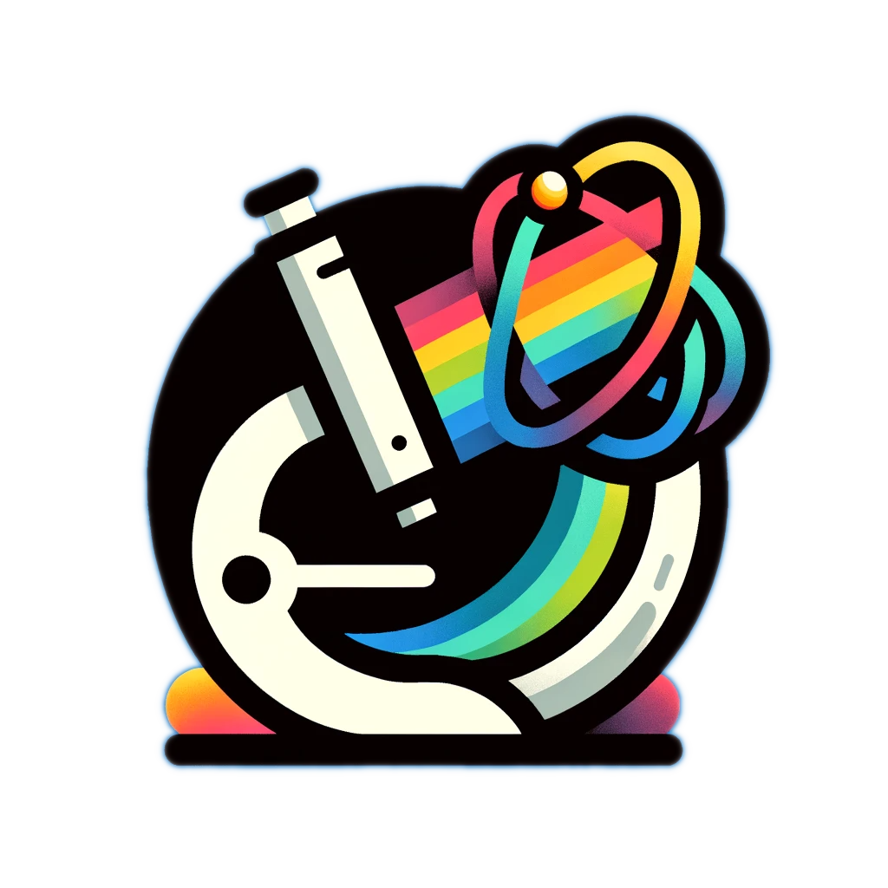

<a name="readme-top"></a>

[![Contributors][contributors-shield]][contributors-url]
[![Forks][forks-shield]][forks-url]
[![Stargazers][stars-shield]][stars-url]
[![Issues][issues-shield]][issues-url]
<!-- [![GPLv3 License][license-shield]][license-url] -->
<!-- [![LinkedIn][linkedin-shield]][linkedin-url] -->


<!-- PROJECT LOGO -->
<br />
<div align="center">
  <a href="https://github.com/zezhong-zhang/gos_demo">
    
  </a>

  <h3 align="center">GOS Demo</h3>

  <p align="center">
    Tutorial on how to use Dirac GOS for EELS quantification
    <br />
    <!-- <a href="https://gos_demo.readthedocs.io/en/latest/"><strong>Explore the docs »</strong></a> -->
    <br />
    <br />
    <a href="https://github.com/zezhong-zhang/gos_demo/tree/main/notebooks">View Demo</a>
    ·
    <a href="https://github.com/zezhong-zhang/gos_demo/issues">Report Bug</a>
    ·
    <a href="https://github.com/zezhong-zhang/gos_demo/issues">Request Feature</a>
  </p>
</div>


<!-- TABLE OF CONTENTS -->
<details>
  <summary>Table of Contents</summary>
  <ol>
    <li>
      <a href="#about-the-project">About The Project</a>
      <ul>
        <li><a href="#built-with">Supported quantification packages</a></li>
      </ul>
    </li>
    <li>
      <a href="#getting-started">Getting Started</a>
      <ul>
        <li><a href="#prerequisites">Prerequisites</a></li>
        <li><a href="#installation">Installation</a></li>
      </ul>
    </li>
    <li><a href="#usage">Usage</a></li>
    <li><a href="#roadmap">Roadmap</a></li>
    <li><a href="#contributing">Contributing</a></li>
    <li><a href="#license">License</a></li>
    <li><a href="#contact">Contact</a></li>
    <li><a href="#acknowledgments">Acknowledgments</a></li>
  </ol>
</details>


<!-- ABOUT THE PROJECT -->
## About The Project

<!-- [![Product Name Screen Shot][product-screenshot]](https://github.com/zezhong-zhang/gos_demo) -->
Quantitative electron energy-loss spectroscopy (EELS) requires model-based fitting of observed spectra with theoretical differential cross-sections calculated from a generalized oscillator strength (GOS) database with experimental parameters. [Here](https://zenodo.org/records/11199911), we provide a GOS tabulation by including the full relativistic effects using the Dirac equation within the local density approximation, which is particularly important for core-shell electrons of heavy elements with strong spin-orbit coupling. This has been done for all elements in the periodic table (up to Z = 118) for all possible excitation edges using modern computing capabilities and parallelization algorithms. We make these tabulated GOS available under a [CC-BY 4.0](https://creativecommons.org/licenses/by/4.0/legalcode)[ license](https://creativecommons.org/licenses/by/4.0/legalcode) to the benefit of both academic users as well as allowing integration into commercial solutions.

This tutorial will provide a step-by-step guide on how to use the Dirac-based GOS database for EELS quantification.

This repo is currently under development. 

<p align="right">(<a href="#readme-top">back to top</a>)</p>


### Supported quantification packages

To run the notebooks, please install the following packages:

- [x] [pyEELSMODEL](https://github.com/joverbee/pyEELSMODEL)
- [ ] [exspy](https://github.com/hyperspy/exspy)


<p align="right">(<a href="#readme-top">back to top</a>)</p>


<!-- GETTING STARTED -->
## Getting Started

To get code running locally, let's first create a conda environment.

```bash
conda create -n gos python=3.11
conda activate gos
git clone https://github.com/joverbee/pyEELSMODEL.git
pip install -e .
```

<p align="right">(<a href="#readme-top">back to top</a>)</p>


<!-- USAGE EXAMPLES -->
## Usage

To run the EELS quantification using Dirac GOS, please check the [tutorials](https://github.com/zezhong-zhang/gos_demo/tree/main/notebooks).

- Step 1, we need to compute the DDSCS from the GOS database for the non-relativistic scattering but with atomic orbitals obtained from the Dirac equation. Then we need to account for the relativistic nature of the fast incoming electron. 

- Step 2, we need to integrate the DDSCS within the EELS collection aperture to obtain the differential cross-sections for parallel illumination. If convergent beam illumination is used in STEM-EELS, we have to correct it with a geometric cross-correlation function. The momentum space integration for both parallel and convergent beam illumination is implemented in pyEELSModel. 

- Step 3, the computed differential cross-sections for all edges are fitted together to the experimental spectrum for quantification. During the model-based fitting process, the core-loss spectrum can be convoluted with the low-loss spectrum to consider the source energy dispersion and plural plasmon scattering. The fitting procedure can be performed using the existing packages such as EELSModel, HyperSpy, or Gatan Digital Micrograph, which will support the Dirac-based GOS. In this tutorial, we will first demonstrate with pyEELSModel.

<p align="right">(<a href="#readme-top">back to top</a>)</p>


<!-- ROADMAP -->
## Roadmap
### TO-DO list
- [ ] Provide the EELS data example
- [ ] Patch known issues in pyEELSMODEL
- [ ] Add relativistic corrections to pyEELSMODEL
- [ ] Develop the pyEELSMODEL notebook
- [ ] Add Dirac GOS support in exspy 
- [ ] Develop the exspy notebook

See the [open issues](https://github.com/zezhong-zhang/gos_demo/issues) for a full list of proposed features (and known issues).

<p align="right">(<a href="#readme-top">back to top</a>)</p>


<!-- CONTRIBUTING -->
## Contributing

Contributions are what makes the open-source community such an amazing place to learn, inspire, and create. Any contributions you make are **greatly appreciated**.

If you have a suggestion that would make this better, please fork the repo and create a pull request. You can also simply open an issue with the tag "enhancement".
Don't forget to give the project a star! Thanks again!

1. Fork the Project
2. Create your Feature Branch (`git checkout -b feature/AmazingFeature`)
3. Commit your Changes (`git commit -m 'Add some AmazingFeature'`)
4. Push to the Branch (`git push origin feature/AmazingFeature`)
5. Open a Pull Request

<p align="right">(<a href="#readme-top">back to top</a>)</p>


<!-- LICENSE -->
## License

Distributed under the GPLv3 License. See `LICENSE` for more information.

<p align="right">(<a href="#readme-top">back to top</a>)</p>


<!-- CONTACT -->
## Contact

Zezhong Zhang - zezhong.zhang@uantwerpen.be

Project Link: [https://github.com/zezhong-zhang/gos_demo](https://github.com/zezhong-zhang/gos_demo)

<p align="right">(<a href="#readme-top">back to top</a>)</p>


<!-- ACKNOWLEDGMENTS -->
## Acknowledgments
* Thanks to Dr.Ivan Lobato, Dr.Hamish Brown, Dr.Daen Jannis, Prof.Johan Verbeeck, Prof.Dirk Lamoen, Prof.Sandra Van Aert and Prof.Peter Nellist for their support and suggestions.
* Acknowledge the fundings: 
  * Research Foundation Flanders (FWO, Belgium) through Project No.G.0502.18N. 
  * European Research Council (ERC) under the European Union’s Horizon 2020 research and innovation programme (Grant Agreement No. 770887 PICOMETRICS and No. 823717 ESTEEM3). 
  * Vlaams Supercomputer Centrum (VSC) through Tier-1 project No.2023.023. 
  * Research Foundation Flanders (FWO, Belgium) through travel grant No.V463823N
* Readme page based on [Best-README-Template](https://github.com/othneildrew/Best-README-Template)

<p align="right">(<a href="#readme-top">back to top</a>)</p>


<!-- MARKDOWN LINKS & IMAGES -->
<!-- https://www.markdownguide.org/basic-syntax/#reference-style-links -->
[contributors-shield]: https://img.shields.io/github/contributors/zezhong-zhang/gos_demo.svg?style=for-the-badge
[contributors-url]: https://github.com/zezhong-zhang/gos_demo/graphs/contributors
[forks-shield]: https://img.shields.io/github/forks/zezhong-zhang/gos_demo.svg?style=for-the-badge
[forks-url]: https://github.com/zezhong-zhang/gos_demo/network/members
[stars-shield]: https://img.shields.io/github/stars/zezhong-zhang/gos_demo.svg?style=for-the-badge
[stars-url]: https://github.com/zezhong-zhang/gos_demo/stargazers
[issues-shield]: https://img.shields.io/github/issues/zezhong-zhang/gos_demo.svg?style=for-the-badge
[issues-url]: https://github.com/zezhong-zhang/gos_demo/issues
[license-shield]: https://img.shields.io/github/license/zezhong-zhang/gos_demo.svg?style=for-the-badge
[license-url]: https://github.com/zezhong-zhang/gos_demo/blob/main/LICENSE
[linkedin-shield]: https://img.shields.io/badge/-LinkedIn-black.svg?style=for-the-badge&logo=linkedin&colorB=555
[linkedin-url]: https://linkedin.com/in/zezhong-zhang-062a0838
[product-screenshot]: images/screenshot.png